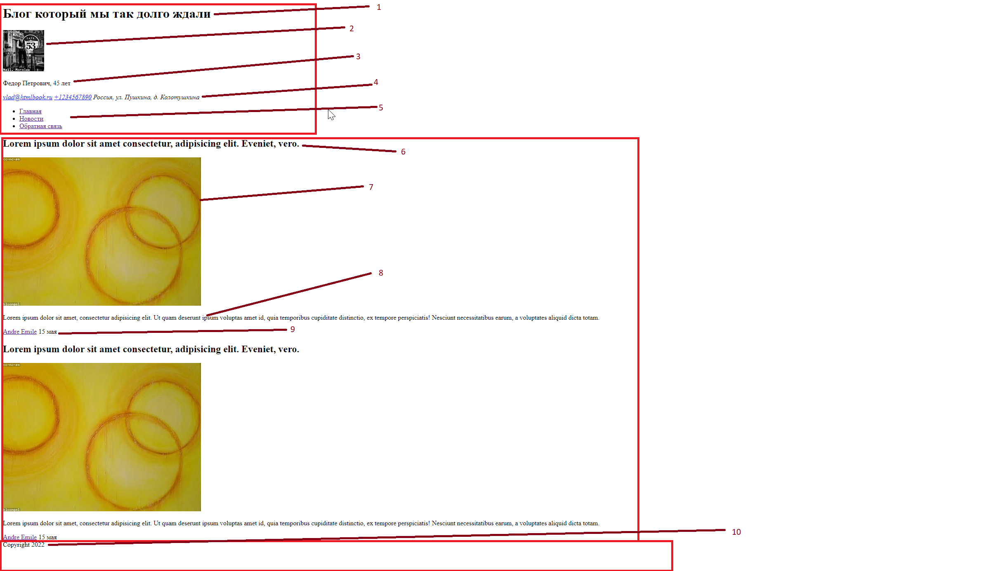

### Сделать разметку для страницы блога

#### Начало работы

Работу начать в файле `public/index.html`

Предварительно установить все зависимости `npm i`

Если что то пошло не так, удалить папку `node_modules`

И снова `npm i`

для запуска локального сервера использовать `npm run dev`
для получения готового результата `npm run build`

#### Описание задачи

Необходимо реализовать верстку блога как на скрине, ниже я опишу значение каждого пункта вестки

Первый блок это заголовочный блок, там размещается например общая инфа о сайте, название, навигационная панель, инфа о текущем пользователе;

Второй блок статей, в нем находится контент который можно потребить, список товаров, список статей, какой нибудь еще список; 

Третий блок это блок подвал. Там может частично дублироваться информация заголовка. Он использовался сначала, чтобы содержать формальную неинтересную инфрмацию типо прав пользователя и тд но потом ux инженеры поняли что там можно напоминать пользователю инфу, которая была представлена в заголовке и стали дублировать в подвале инфу с заголовков, типо телефонов, адресов, навигационной панели и тд

1. Название всего сайта
2. Фотка текущего пользователя
3. Имя и возраст
4. Контактная инфа
5. Навигационная панель
6. Заголовок статьи
7. Фотка статьи
8. Контент статьи
9. Имя автора и дата публикации статьи
10. Информация о защите прав в подвале

### Для успешного выполнения практики необходимо ознакомиться с:

1. тегами `h1 h2 h3 img a div span time main ui li nav header footer article aside` и возможно другими
2. Прогуглить понятие блочных и строчных тегов, какие можно вкладывать в другие, какие нет
3. Здесь можно посмореть правильные именования классов в тегах [Common-Words](https://github.com/yoksel/common-words)   
4. Научиться пользоваться emmet, он встроен в visual studio в других текстовых редакторах либо тоже встроен, либо устанавливается через плагин (сильно ускоряет верстку)
5. Можно использовать сервис [loremflickr.com](https://loremflickr.com/) ``  можно менять разрешение добавлять ключевые слова например `https://loremflickr.com/480/360/face` удобно чтобы не запариваться с картинками